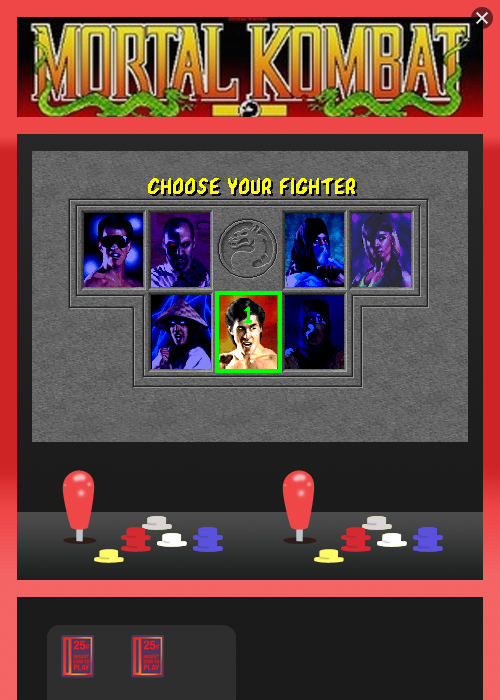
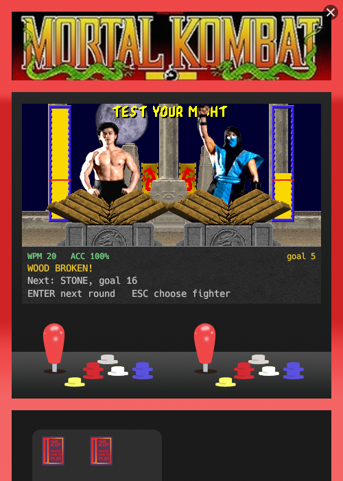

# Test Your Might

A typing trainer dressed up as the "Test Your Might" bonus round from the
original Mortal Kombat arcade game. Pick a fighter, then type as fast as you
can for 30 seconds to power up your gauge and smash through wood, stone,
steel, ruby and finally diamond, each one demanding a little more of you.

It runs as a small, borderless, always-on-top window shaped like the arcade
cabinet: a single native binary with all the art built in and nothing to
install.

A hobby project, built for fun.

<p>
  
  
</p>

## How to play

1. **Choose your fighter.** Only Liu Kang is unlocked at the start. Your
   opponent is a random different fighter.
2. **Type.** The timer starts on your first keypress. Type the words on the
   floor of the stage; your speed fills the yellow gauge beside your fighter.
3. **Beat the red bar.** When the 30 seconds are up, both fighters strike.
   If your final WPM reached the goal, your slab breaks and you move on to the
   next material.

### Controls

| Screen | Key | Action |
| --- | --- | --- |
| Character select | Arrow keys | Move the selector |
| Character select | Enter | Pick the highlighted fighter |
| Test Your Might | Letters / Space | Type the words (Space moves to the next word) |
| Test Your Might | Backspace | Delete a letter; keeps going back into earlier words |
| Test Your Might | Enter (or R) | After a round: start the next round |
| Test Your Might | Esc | Back to character select (a round in progress is discarded) |

Drag the window by the cabinet art around the screen; close it with the X in
the top-right corner.

### Scoring and progression

- **WPM** counts correctly typed characters (5 characters = 1 word) over the
  30 seconds. **Accuracy** is correct keystrokes out of all keystrokes.
- **Materials** go wood -> stone -> steel -> ruby -> diamond. Breaking one
  moves you to the next; diamond is the last.
- **The goal** (the red bar) starts at 5 WPM. After that it's the average of
  your last 5 rounds, minus a margin that shrinks as the materials get harder:
  25% on wood, 20% stone, 15% steel, 10% ruby, 5% diamond.
- **The gauge** is scaled so the red bar sits low on easy materials and high
  on hard ones, so beating wood feels like a surge and beating diamond takes
  nearly the whole gauge. It follows your recent speed early in the round
  and settles onto your final WPM by the end.
- **The CPU** always makes it look close, but only breaks its slab below
  diamond. Beat diamond and it's the CPU that falls short.

### Saved progress

Your current material and every finished round (WPM, accuracy, goal, result,
time) are saved to `progress.json`:

- Windows: `%APPDATA%\test-your-might\data\progress.json`
- Linux: `~/.local/share/test-your-might/progress.json`

It's written once at the end of each round, so a round you quit midway isn't
saved. Delete the file to start over from scratch. If the file is ever
unreadable, the app moves it aside as `progress.json.unreadable-<time>`
instead of overwriting it.

## Building and running

Requires [Rust](https://rustup.rs) (stable).

```
git clone <this repo>
cd test-your-might
cargo run --release
```

`cargo build --release` produces a standalone executable in
`target/release/`. All the art is embedded, so the executable is the whole
app: copy it anywhere and run it.

Development so far has been on Linux under WSL (the window shows up on the
Windows desktop through WSLg). Native Windows builds and a packaged `.exe` are
the next step and haven't been tested yet.

### Development notes

- [`docs/dev-environment.md`](docs/dev-environment.md): toolchain setup,
  WSL notes, and env-var dev hooks for jumping straight into a round, typing
  automatically and saving screenshots.
- [`PROJECT.md`](PROJECT.md): current state, layout measurements and what's
  not built yet.
- `cargo test` runs the unit tests; `cargo clippy --all-targets` should be
  clean.

## Built with

- [Rust](https://www.rust-lang.org/)
- [eframe / egui](https://github.com/emilk/egui) (glow backend) for the
  window and rendering
- [image](https://crates.io/crates/image) for decoding the embedded PNG art
- [rand](https://crates.io/crates/rand) for word and opponent picks
- [serde](https://serde.rs/) + [directories](https://crates.io/crates/directories)
  for saved progress

## Disclaimer

This is an unofficial, non-commercial fan project. It isn't affiliated with
or endorsed by Warner Bros. Games, NetherRealm Studios or Midway. Mortal
Kombat, its characters and its artwork are trademarks and copyrights of
their respective owners.
